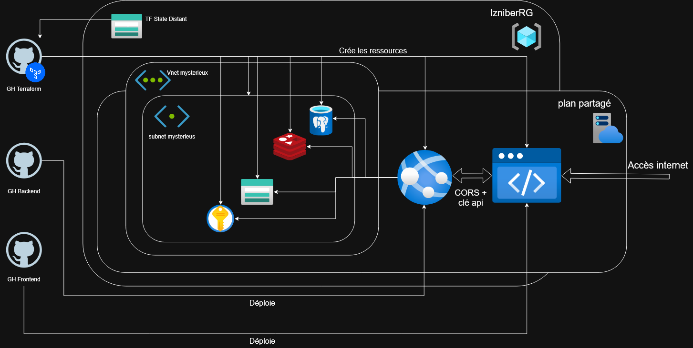

# Alors... je sais pas encore comment je vais structurer cette doc, on va voir

### Architecture Decision Records

[github plutot que gitlab](./ADR-git.md)  
[services managés plutôt qu'AKS](./ADR-service.md)  
[le reseau dans azure je comprends pas bien encore, je ferais ça au fur et à mesure]

### signer les commits

j'avais déjà créé une clé gpg pour signer mes commits gitlab sur wsl, donc j'ai décidé d'utiliser la même clé gpg pour github, étant donné que sur mon terminal cette clé elle signe mes commit git tout court, les commandes pour retrouver la clé publique (à rentrer dans les paramatres de mon profil github) c'est :  
``` gpg -k``` pour avoir la liste de mes clés gpg (j'en avais une seule ici)  
```gpg --armor --export <id-de-la-cle>``` export pour afficher, et armor pour que ce soit pas en binaire, que ce soit lisible

### le fameux schema

Pour l'instant la façon dont je vois l'architecture que je vais déployer c'est comme ça, on verra si ça marche vraiment, tout ça  


