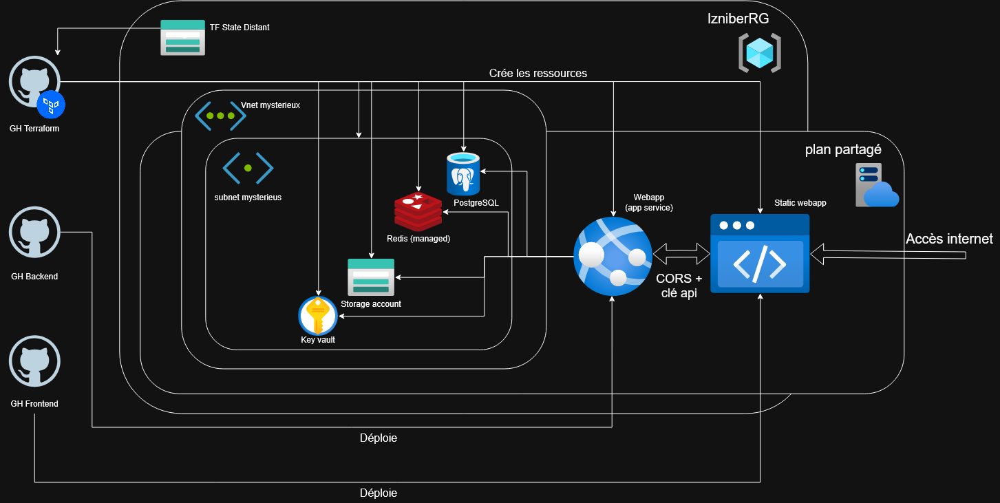

# Alors... je sais pas encore comment je vais structurer cette doc, on va voir

### Architecture Decision Records

[github plutot que gitlab](./ADR-git.md)  
[services managés plutôt qu'AKS](./ADR-service.md)  
[le reseau dans azure je comprends pas bien encore, je ferais ça au fur et à mesure]

### Signer les commits

j'avais déjà créé une clé gpg pour signer mes commits gitlab sur wsl, donc j'ai décidé d'utiliser la même clé gpg pour github, étant donné que sur mon terminal cette clé elle signe mes commit git tout court, les commandes pour retrouver la clé publique (à rentrer dans les paramatres de mon profil github) c'est :  
``` gpg -k``` pour avoir la liste de mes clés gpg (j'en avais une seule ici)  
```gpg --armor --export <id-de-la-cle>``` export pour afficher, et armor pour que ce soit pas en binaire, que ce soit lisible

### Le fameux schema

Pour l'instant la façon dont je vois l'architecture que je vais déployer c'est comme ça, on verra si ça marche vraiment, tout ça  



### Terraform

Pour commencer je vais créer le storage account qui contiendra le container avec le state distant de terraform, j'ai besoin de le faire qu'une seule fois et [la doc](https://learn.microsoft.com/en-us/cli/azure/storage/account?view=azure-cli-latest#az-storage-account-create) dis bien comment faire.  
Puis un storage container dans le storage account ([la doc ici](https://learn.microsoft.com/en-us/cli/azure/storage/container?view=azure-cli-latest#az-storage-container-create))  

Pour trouver quoi mettre dans les .tf je vais me baser sur la [doc terraform](https://registry.terraform.io/providers/hashicorp/azurerm/latest/docs) pour commencer.  (malheuresement je trouve qu'on a pas assez le temps pour faire tous les main.tf à la main, donc j'ai envoyé les docs que j'ai trouvé à deepseek pour qu'il me genere les main.tf, j'aurais bien aimé digger les docs pour savoir ce qu'il est possible de mettre dedans, mais pas possible)

Pour créer l'infra en local, toujours:  
```terraform init``` (à refaire à chaque ajout de module)  
```terraform validate``` (+ ```terraform fmt``` pour que les fichiers soit toujours bien joli au cas où)  
```terraform plan```  
```terraform apply```